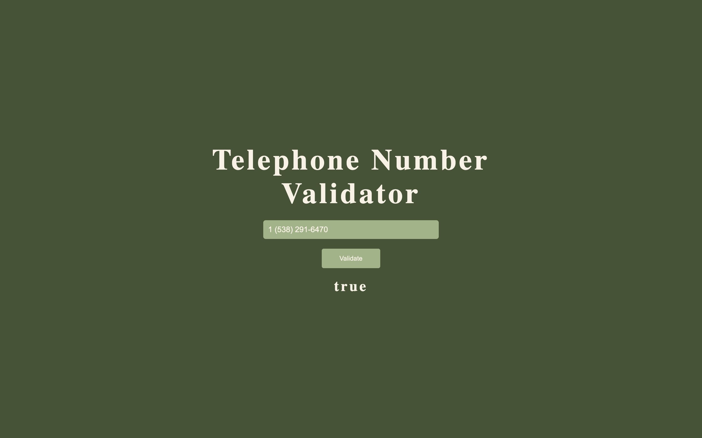

# Telephone Number Validator

A Program that verified is a Telephone Number is a valid US Number

## Screenshots

## Demo

[Link](https://thepageguy.github.io/telephone_number_validator/)

## Author

- [@thepageguy](https://www.github.com/thepageguy)

## Acknowledgement

- [FreeCodeCamp](https://www.freecodecamp.org/)

## Tech Stack

**Languages:** HTML5, CSS3 and JavaScript

## Features

- Responsive

- Valid Format
  - 555-555-5555
  - (555)555-5555
  - (555) 555-5555
  - 555 555 5555
  - 5555555555
  - 1 555 555 5555

## Lessons Learned

Interdimate JS Regex Expresions and Testing

## Feedback

If you have any feedback, please reach out at thepageguy@mailfence.com.
